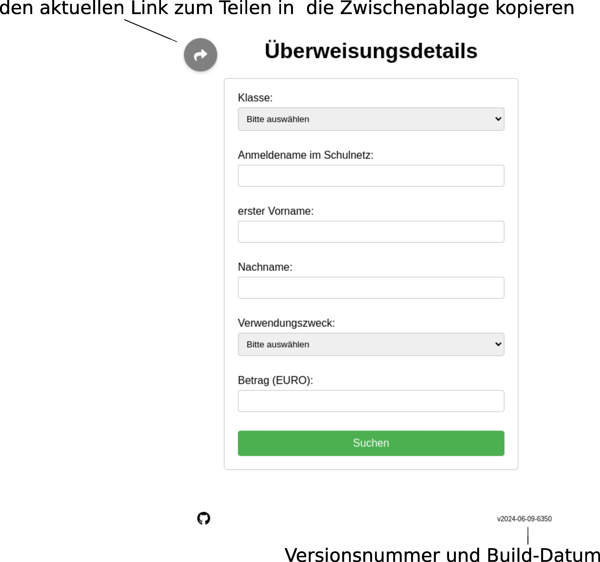
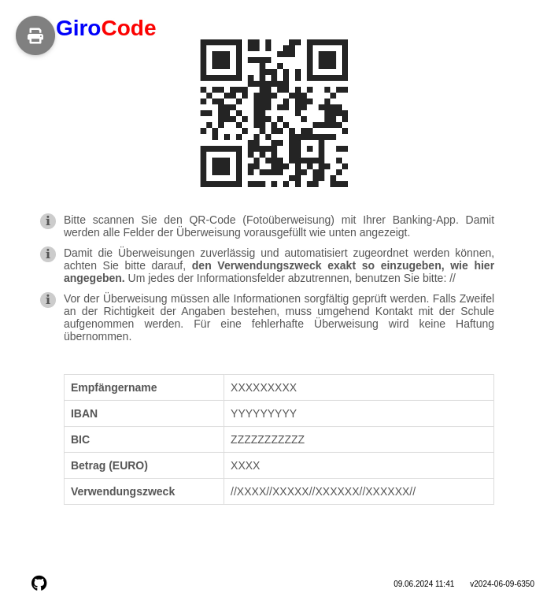

Auf der Startseite wird das Formular angezeigt. Dabei werden die Personendaten und der Verwendungszweck abgefragt. Falls in dem Verwendungszweck (Event) der Betrag hinterlegt ist, dann wird die Eingabe bei dem Betrag-Feld gesperrt.

Falls die eingegebenen Daten gültig sind, muss zuerst der Disclaimer akzeptiert werden:

Anschliessend wird der GiroCode (EPC-Code) zur Fotoüberweisung angezeigt.

Der Verwendungszweck ist so codiert, dass die Überweisungsinformationen aus der Umsatzliste der jeweiligen Bank automatisiert ausgelesen und zugeordnet werden können.