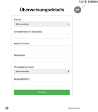

## Überweisungsdetails anzeigen

### Formular ausfüllen

Auf der Startseite wird das Formular angezeigt. Dabei werden die Personendaten und der Verwendungszweck abgefragt. Falls in dem Verwendungszweck (Event) der Betrag hinterlegt ist, dann wird die Eingabe bei dem Betrag-Feld gesperrt.

Es werden nur Überweisungsdetails für **gültige Nutzerdatensätze** für **zugewiesene Verwendungszwecke** angezeigt.

  

### Disclaimer

Falls die eingegebenen Daten gültig sind, wird zu den Zahlungsinformationen weitergeleitet und ein Disclaimer muss akzeptiert werden.

  

### Fotoüberweisung

Anschliessend wird der GiroCode (EPC-Code) zur Fotoüberweisung angezeigt.

  

Der Verwendungszweck ist so codiert, dass die Überweisungsinformationen aus der Umsatzliste der jeweiligen Bank automatisiert ausgelesen und zugeordnet werden können.

## Organisation/Kommunikation der Zahlungsinformationen

### Direktes Teilen von Events

Wird das Formular aufgerufen und der Share-Button geklickt, dann wird ein Link mit dem Inhalt des Formulars erstellt. Beispielsweise kann damit eine Klasse und ein Verwendungszweck (Event) vorausgefüllt werden. Für einen individuell gestalteten Link ist es empfehlenswert einen Link-Shortener Dienst zu verwenden und diesen Link dann zu Teilen (beispielsweise auf einem Elternbrief).

In der Regel ist es jedoch vorzuziehen, ein [Code-Wort](#code-wort) für jede Veranstaltung zu wählen und diesen Link zu kommunizieren.

### Teilen von Links mit Code-Wörtern 

Ein oder mehrere Events können über ein [Code-Wort](deploy/#event-config) gebündelt werden. Aus dem [Beispiel aus der Installationsanleitung](deploy/#event-config) würde `https://meinedomain.de/mycode` die Events `Event3` und `Event4` anzeigen. Falls mit einem Code-Wort nur ein Event verknüft ist, wird dieses in der Dropdown-Liste automatisch ausgewählt.

Ein Anwendungsfall hiervon wäre beispielsweise eine bestimmte Veranstaltung, mit mehreren verschiedenen Zahlungsoptionen, die als getrennte Events mit gemeinsamen Code-Wort angelegt werden.

